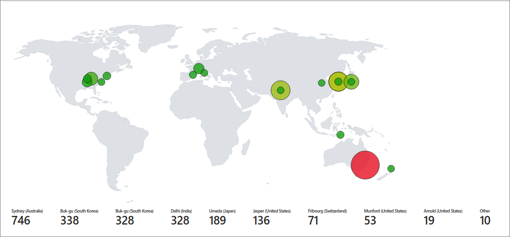
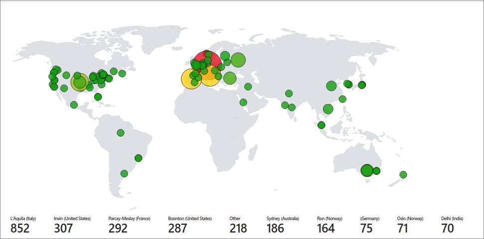
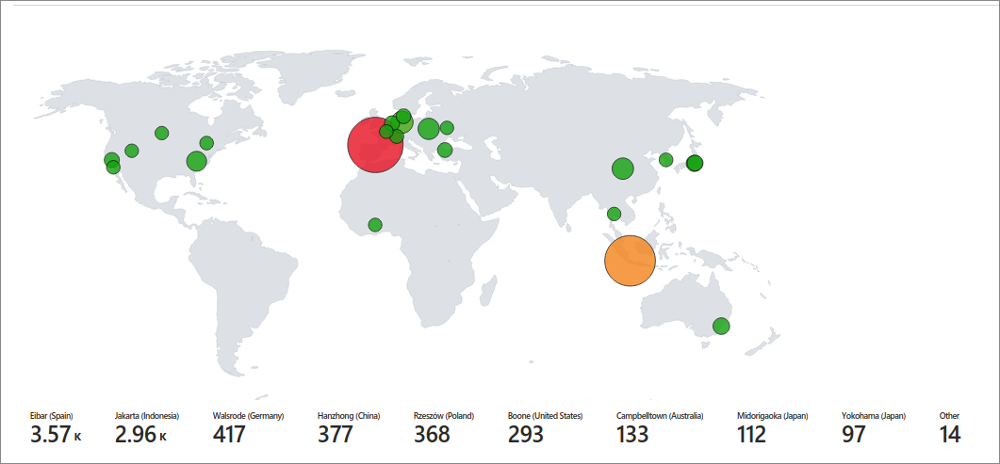

## Azure-Honeynet
Honeynet built using the azure cloud platform.

## Introduction

In this project, I build a mini honeynet in Azure and ingest log sources from various resources into a Log Analytics workspace, which is then used by Microsoft Sentinel to build attack maps, trigger alerts, and create incidents. I measured some security metrics in the insecure environment for 24 hours, apply some security controls to harden the environment, measure metrics for another 24 hours, then show the results below. The metrics we will show are:

- SecurityEvent (Windows Event Logs)
- Syslog (Linux Event Logs)
- SecurityAlert (Log Analytics Alerts Triggered)
- SecurityIncident (Incidents created by Sentinel)
- AzureNetworkAnalytics_CL (Malicious Flows allowed into our honeynet)

## Architecture Before Hardening / Security Controls
The architecture of the mini honeynet in Azure consists of the following components:

- Virtual Network (VNet)
- Network Security Group (NSG)
- Virtual Machines (2 windows, 1 linux)
- Log Analytics Workspace
- Azure Key Vault
- Azure Storage Account
- Microsoft Sentinel

For the "BEFORE" metrics, all resources were originally deployed, exposed to the internet. The Virtual Machines had both their Network Security Groups and built-in firewalls wide open, and all other resources are deployed with public endpoints visible to the Internet; aka, no use for Private Endpoints.

For the "AFTER" metrics, Network Security Groups were hardened by blocking ALL traffic with the exception of my admin workstation, and all other resources were protected by their built-in firewalls as well as Private Endpoint

## Metrics Before Hardening / Security Controls

The following table shows the metrics we measured in our insecure environment for 24 hours:
Start Time 12/13/2023 19:04:29
Stop Time 12/14/2023 19:04:29

| Metric                   | Count
| ------------------------ | -----
| SecurityEvent            | 20494
| Syslog                   | 8099
| SecurityAlert            | 4
| SecurityIncident         | 158
| AzureNetworkAnalytics_CL | 3818

## Metrics After Hardening / Security Controls

The following table shows the metrics we measured in our environment for another 24 hours, but after we have applied security controls:
Start Time N/A
Stop Time	N/A

| Metric                   | Count
| ------------------------ | -----
| SecurityEvent            | 0
| Syslog                   | 0
| SecurityAlert            | 0
| SecurityIncident         | 0
| AzureNetworkAnalytics_CL | 0
